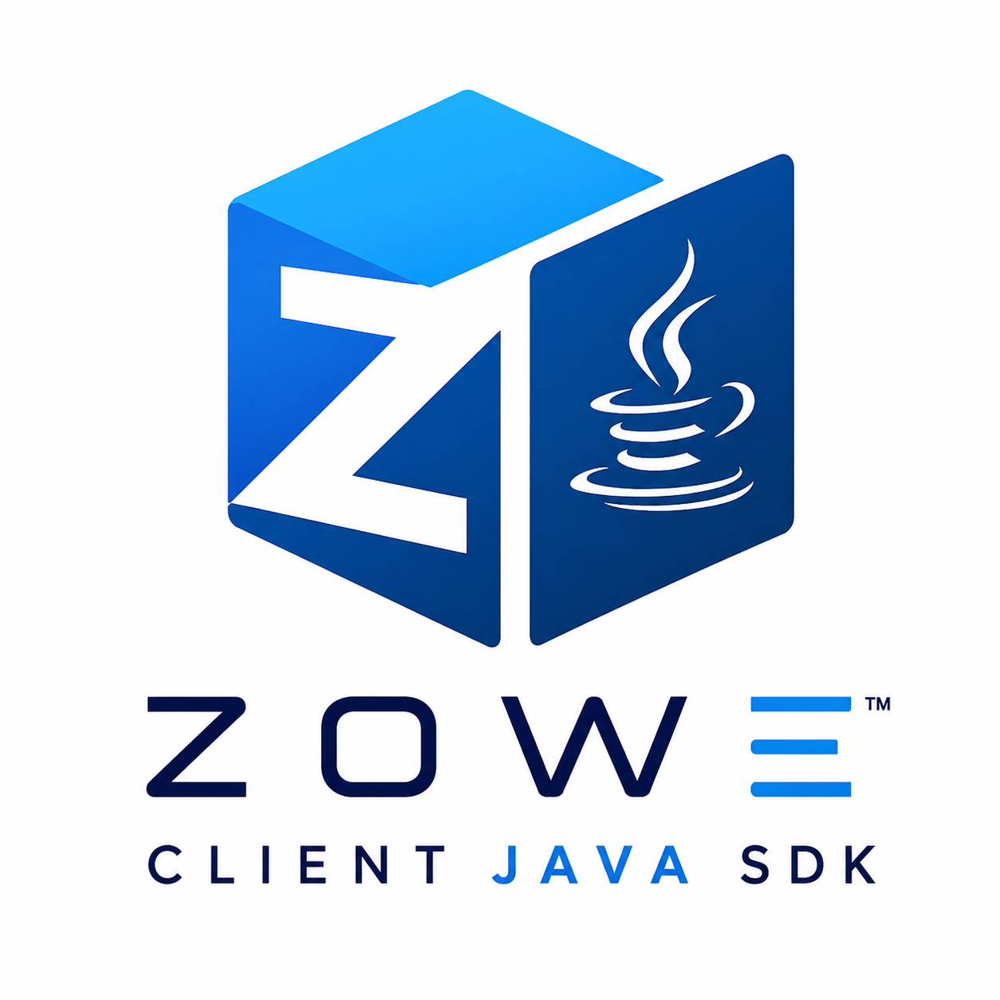

This program and the accompanying materials are made available under the terms of the Eclipse Public License v2.0 which accompanies this distribution, and is available at https://www.eclipse.org/legal/epl-v20.html

SPDX-License-Identifier: EPL-2.0

Copyright Contributors to the Zowe Project.

# Zowe Java Client SDK




[](https://central.sonatype.com/search?q=org.zowe.client.java.sdk&smo=true)
[](https://javadoc.io/doc/org.zowe.client.java.sdk/zowe-client-java-sdk)

This project is a subproject of **Zowe**, focused on modernizing and improving the mainframe user experience. Zowe is an open-source project hosted by the **Open Mainframe Project**, a Linux Foundation project dedicated to advancing innovation and collaboration within the mainframe community.

The **Zowe Java SDK** enables developers to leverage the underlying **z/OSMF REST APIs** available on a z/OS system, allowing them to build Java-based client applications and automation scripts that seamlessly interact with z/OS environments.

For example, one of the SDK’s API packages provides functionality for uploading and downloading z/OS data sets. Developers can use this package to quickly build client applications that manage and interact with z/OS data sets without needing to implement the underlying REST API communication themselves.

The Java SDK is part of the broader Zowe SDK ecosystem, joining existing language-specific SDKs that provide similar capabilities across different programming languages. It brings these capabilities to the Java community while aligning closely with the functionality and design patterns established by the Node.js SDK.

The SDK also provides additional functionality beyond some existing SDK implementations. For example, the **JobMonitor** class includes built-in capabilities designed to simplify and automate common job-monitoring tasks.

Documentation and implementation work covering the primary feature set can be found in the following MVP issues:

* [MVP Issue #1](https://github.com/zowe/zowe-client-java-sdk/issues/5)
* [MVP Issue #2](https://github.com/zowe/zowe-client-java-sdk/issues/219)
* [MVP Issue #3](https://github.com/zowe/zowe-client-java-sdk/issues/281)
* [MVP Issue #4](https://github.com/zowe/zowe-client-java-sdk/issues/338)

In addition to the MVP milestones, the following releases include further enhancements and detailed release notes:

* [Version 4](https://github.com/zowe/zowe-client-java-sdk/pull/363)
* [Version 5](https://github.com/zowe/zowe-client-java-sdk/issues/414)
* [Version 5.1.0](https://github.com/zowe/zowe-client-java-sdk/issues/429)
* [Version 5.2.0](https://github.com/zowe/zowe-client-java-sdk/issues/432)
* [Version 6.0.0](https://github.com/zowe/zowe-client-java-sdk/issues/451)
* [Version 6.1.1](https://github.com/zowe/zowe-client-java-sdk/issues/455)
* [Version 6.1.2](https://github.com/zowe/zowe-client-java-sdk/issues/459) 
* [Version 6.2.0](https://github.com/zowe/zowe-client-java-sdk/issues/464)
* [Version 6.3.0](https://github.com/zowe/zowe-client-java-sdk/issues/487)  
* [Version 6.3.3](https://github.com/zowe/zowe-client-java-sdk/issues/499)  
* [Version 7.0.0](https://github.com/zowe/zowe-client-java-sdk/issues/577)  
* [Version 7.0.1](https://github.com/zowe/zowe-client-java-sdk/pull/601)
* [Version 7.0.2](https://github.com/zowe/zowe-client-java-sdk/issues/614)
* [Version 7.0.3](https://github.com/zowe/zowe-client-java-sdk/pull/617)
  
## Prebuilt API Services     
    
Prebuilt API services are located in the following packages/classes:  

zowe.client.sdk.zosconsole.methods  
  
    ConsoleCmd
    ConsoleGet
  
zowe.client.sdk.zosfiles.dsn.methods  
  
    DsnCopy
    DsnCreate
    DsnDelete
    DsnGet
    DsnList
    DsnUpdate
    DsnWrite
  
zowe.client.sdk.zosfiles.uss.methods  
    
    UssChangeMode
    UssChangeOwner
    UssChangeTag
    UssCopy
    UssCreate
    UssDelete
    UssExtAttrs
    UssGet
    UssGetAcl
    UssList
    UssMount
    UssSetAcl
    UssWrite

zowe.client.sdk.zosjobs.methods
  
    JobCancel
    JobDelete
    JobGet
    JobMonitor
    JobSubmit

zowe.client.sdk.zoslogs.method  
  
    ZosLog  

zowe.client.sdk.zosmfauth.methods  
  
    ZosmfLogin
    ZosmfLogout  
    ZosmfPassword  
    
zowe.client.sdk.zosmfinfo.methods  
  
    ZosmfStatus  
    ZosmfSystems   

zowe.client.sdk.zosmfworkflow.methods

    WrokflowArchive
    WorkflowCancel
    WorkflowCreate  
    WorkflowDelete
    WorkflowGet
    WorkflowList
    WorkflowStart

zowe.client.sdk.zostso.methods  
  
    TsoCmd
    TsoPing
    TsoReply
    TsoSend
    TsoStop

zowe.client.sdk.zosuss.method  
  
    UssCmd   

zowe.client.sdk.zosvariables.method

    VariableCreate
    VariableDelete
    VariableExport
    VariableGet
    VariableImport
          
## TeamConfig Package  
  
The TeamConfig package provides API methods to retrieve and update a profile section from Zowe Global Team Configuration with keytar information to help perform connection processing without a hard coding username and password. Keytar represents credentials stored securely on your computer when performing the Zowe Global Initialize [command](https://docs.zowe.org/stable/user-guide/cli-using-initializing-team-configuration/) which prompts you for username and password.   
  
TeamConfig class only supports Zowe Global Team Configuration provided by Zowe V2.  
  
With Zowe CLI and Global Team Configuration initialized, you can use TeamConfig API methods to retrieve a profile type which will include the secure username and password information stored in our OS credential store manager.   
  
You can use this information to create a dynamic ZosConnection object to perform z/OSMF authentication for all the other packages. This avoids the need to hard code values.    
  
See the following package/class:  
  
zowe.client.sdk.teamconfig  
    
    TeamConfig
    
NOTE:  
Whenever you encounter a JSON parse error for reading the Zowe Team Configuration file, make sure to include double quotes around keys and its values.  
  
## Http Rest Processing
  
SDK release version 2 uses Unirest 3.x Http functionality.  
  
SDK release version 3 and above uses Unirest 4.x, which removes the dependency on Apache Commons and provides token processing for Web TOKEN authentication.   
   
Unirest's library provides the ability to retrieve an IBM z/OSMF JSON error document.  
  
For example, the following http GET request will result in an HTTP 500 error:  
  
    https://xxxxxxx.xxxxx.net:xxxx/zosmf/restfiles/ds?
  
and the JSON error report document body response is:  
  
    {"rc":4,"reason":13,"category":1,"message":"query parm dslevel= or volser= must be specified"} 

## Authenticating to z/OSMF

All REST API calls to z/OSMF are transmitted over an **HTTPS** encrypted transport channel (TLS). The SDK supports three authentication types (`AuthType`) to prove client identity over that encrypted channel:

- **BASIC (`AuthType.BASIC`)**: Authenticates client identity using a username and password sent in the HTTP `Authorization: Basic` header over HTTPS.
- **TOKEN (`AuthType.TOKEN`)**: Authenticates client identity using an authentication token/cookie (e.g. JWT or LTPA token) retrieved via `zosmfLogin` over HTTPS.
- **SSL (`AuthType.SSL`)**: Authenticates client identity via **Mutual TLS (mTLS)** using a PKCS12 (`.p12`) client certificate file containing the client's certificate and private key. No username or password is required because z/OSMF maps the client certificate directly to a mainframe security ID (RACF / ACF2 / Top Secret).

### Client Authentication Examples

For **BASIC** authentication, specify username and password:

```java
ZosConnection connection = ZosConnectionFactory.createBasicConnection("host", 10443, "user", "password");
```

For **Web TOKEN** authentication, specify the token cookie:

```java 
ZosConnection connection = ZosConnectionFactory.createTokenConnection("host", 10443, new Cookie("xxx", "xxx"));
```

With the `zosmfauth` package, `ZosmfAuth` provides an API (`zosmfLogin`) to retrieve authentication tokens (JSON Web and LTPA tokens) using a BASIC request. Web TOKEN support must be enabled on your z/OSMF system. See [README.md](https://github.com/zowe/zowe-client-java-sdk/blob/main/src/main/java/zowe/client/sdk/zosmfauth/README.md) in the `zosmfauth` package for further details and code examples.

For **SSL/TLS Client Certificate Authentication (mTLS)**, create a `ZosConnection` object using a PKCS12 (`.p12`) key store file:

```java
ZosConnection connection = ZosConnectionFactory.createSslConnection("host", 10443, "c:/file.p12", "certpassword");
```

The `.p12` file houses your client certificate and private key, which z/OSMF uses to authenticate your client application without needing a username or password. For `certFilePath`, specify the location and file name of the `.p12` file. For `certPassword`, specify the password for the key store.

### Server Certificate Validation Modes

During the HTTPS TLS handshake, Java validates the z/OSMF **server's SSL certificate**. Server certificate validation applies across all authentication types (`BASIC`, `TOKEN`, and `SSL`). The SDK supports three server certificate validation modes. For detailed step-by-step instructions on exporting server certificates from your browser and importing them, see the [core package README](src/main/java/zowe/client/sdk/core/README.md#server-certificate-validation--trust-options).

**Default Mode (Standard Certificate Authority Validation)**
- **How it works**: By default (when no system properties are set), the SDK validates the z/OSMF server certificate against the JVM's standard CA truststore (`cacerts`) and enforces standard hostname verification. In many enterprise-managed environments, corporate CAs or public CAs are already pre-installed in Java's `cacerts` out-of-the-box, so no additional configuration is needed. If your corporate CA is installed only in the Windows Certificate Store and not in Java's `cacerts`, setting `-Djavax.net.ssl.trustStoreType=WINDOWS-ROOT` is an optional fallback to instruct Java to read the OS truststore.
- **When to use**: Production or enterprise environments where z/OSMF uses a certificate issued by a public CA or an enterprise Root CA installed in your Java runtime's `cacerts` or Windows certificate store.
  
**Custom TrustStore (`zowe.sdk.truststore.path`)**
- **How it works**: To support self-signed z/OSMF servers securely without bypassing TLS validation, the SDK allows users to specify a separate TrustStore file (`.p12` or `.jks`) that contains the server's public certificate or CA. Set system property `zowe.sdk.truststore.path` to the path of the server TrustStore and optionally `zowe.sdk.truststore.password`. The SDK loads this TrustStore into a `TrustManagerFactory` to validate the server certificate against it while disabling hostname verification.
- **How to set**:

    System.setProperty("zowe.sdk.truststore.path", "/path/to/server-truststore.p12");
    System.setProperty("zowe.sdk.truststore.password", "truststorePassword"); // Optional

Or via JVM launch argument: `-Dzowe.sdk.truststore.path=/path/to/server-truststore.p12`

- **When to use**: Staging, testing, or enterprise environments where z/OSMF uses a self-signed or internal CA certificate and you want strict certificate validation without modifying global JVM `cacerts` or disabling TLS verification.

**Insecure Mode (`zowe.sdk.allow.insecure.connection=true`)**
- **How it works**: Insecure mode is an explicit, optional developer opt-in (disabled by default) designed specifically to bypass server TLS certificate checks for self-signed test environments when users do not have the server certificate or CA in a truststore file. Setting system property `zowe.sdk.allow.insecure.connection` to `"true"` uses `TRUST_ALL_CERTS` to bypass server certificate validation (similar to `curl -k` or `git config http.sslVerify false`) and disables hostname verification. A prominent warning is logged on connection setup.
- **How to set**:  
  
     System.setProperty("zowe.sdk.allow.insecure.connection", "true");

Or via JVM launch argument: `-Dzowe.sdk.allow.insecure.connection=true`
- **When to use**: Isolated test, local sandbox, or lab environments when connecting to self-signed z/OSMF servers without a truststore file.

This same `zowe.sdk.allow.insecure.connection` system property also controls SSH host key verification for the `zosuss` package (see below). By default, both are verified/enforced; setting this property to `true` disables verification for both and is logged as a warning each time it happens.

## SSH Connections (USS Commands)

The zosuss package (see [README.md](https://github.com/zowe/zowe-client-java-sdk/blob/main/src/main/java/zowe/client/sdk/zosuss/README.md)) executes commands over SSH using SshConnection/UssCmd. By default, the target host's SSH host key is verified against the current user's `~/.ssh/known_hosts` file (StrictHostKeyChecking=yes), and unknown or changed host keys cause the connection to fail. Populate that file first, for example by connecting once with a standard ssh client or via `ssh-keyscan`.

To bypass host key verification, set the `zowe.sdk.allow.insecure.connection` system property described above to `true`. This should only be done when the risk is understood, since it allows any host key, including one presented by a man-in-the-middle attacker.

## Requirements

    Compatible with all Java versions 11 and above.
    z/OSMF installed on your backend z/OS instance.  
  
## Code Samples  

[Samples](https://github.com/frankgiordano/zowe-client-java-sdk-examples)    
   
## Demo App  

[ZosShell](https://github.com/frankgiordano/ZosShell)

## Examples  

  See the following GITHUB [Zowe-Java-SDK](https://github.com/Zowe-Java-SDK) location for code examples and applications.  

In the project, you will find code examples located in each package's README.MD file. See:  

  [teamconfig](https://github.com/zowe/zowe-client-java-sdk/blob/main/src/main/java/zowe/client/sdk/teamconfig/README.md)  
  [zosconsole](https://github.com/zowe/zowe-client-java-sdk/blob/main/src/main/java/zowe/client/sdk/zosconsole/README.md)  
  [zosfiles-dsn](https://github.com/zowe/zowe-client-java-sdk/blob/main/src/main/java/zowe/client/sdk/zosfiles/dsn/README.md)  
  [zosfiles-uss](https://github.com/zowe/zowe-client-java-sdk/blob/main/src/main/java/zowe/client/sdk/zosfiles/uss/README.md)  
  [zosjobs](https://github.com/zowe/zowe-client-java-sdk/blob/main/src/main/java/zowe/client/sdk/zosjobs/README.md)  
  [zoslogs](https://github.com/zowe/zowe-client-java-sdk/blob/main/src/main/java/zowe/client/sdk/zoslogs/README.md)  
  [zosmfauth](https://github.com/zowe/zowe-client-java-sdk/blob/main/src/main/java/zowe/client/sdk/zosmfauth/README.md)  
  [zosmfinfo](https://github.com/zowe/zowe-client-java-sdk/blob/main/src/main/java/zowe/client/sdk/zosmfinfo/README.md)  
  [zosmfworkflow](https://github.com/zowe/zowe-client-java-sdk/blob/main/src/main/java/zowe/client/sdk/zosmfworkflow/README.md)  
  [zostso](https://github.com/zowe/zowe-client-java-sdk/blob/main/src/main/java/zowe/client/sdk/zostso/README.md)    
  [zosuss](https://github.com/zowe/zowe-client-java-sdk/blob/main/src/main/java/zowe/client/sdk/zosuss/README.md)  
  [zosvariables](https://github.com/zowe/zowe-client-java-sdk/blob/main/src/main/java/zowe/client/sdk/zosvariables/README.md)  
      
## Build  

Java 11 and above is required to compile JAR file.      
  
The following maven command at the root prompt of the project will produce zowe-client-java-sdk.jar in the target directory:
  
    mvnw clean package  
  
## Logger 
     
For logging, the SDK does NOT include SLF4j (Simple Logging Facade for Java) dependency. 
  
You will need to add SLF4j dependency and plug into your SLF4J by implementing a logging framework of your choice for your project. 
    
## Documentation  

https://javadoc.io/doc/org.zowe.client.java.sdk/zowe-client-java-sdk/latest/index.html  
  
## Maven Central Publication  

https://mvnrepository.com/artifact/org.zowe.client.java.sdk/zowe-client-java-sdk  

## Install Java SDK from an online registry

To install this library in your project, use a build tool such as Maven, Gradle or Ant. Use the following link to get the necessary artifact:

https://mvnrepository.com/artifact/org.zowe.client.java.sdk/zowe-client-java-sdk

For a Maven project add the SDK as a dependency by updating your `pom.xml` as follows:
  
Thin JAR (recommended):
  
        <dependency>
          <groupId>org.zowe.client.java.sdk</groupId>
          <artifactId>zowe-client-java-sdk</artifactId>
          <version>7.0.4</version>
        </dependency>
  
Fat JAR (with dependencies):

        <dependency>
          <groupId>org.zowe.client.java.sdk</groupId>
          <artifactId>zowe-client-java-sdk</artifactId>
          <version>7.0.4</version>
          <classifier>jar-with-dependencies</classifier>
        </dependency>  
  
For a Gradle project add the SDK as a dependency by updating your `build.gradle` as follows:  

Thin JAR (recommended):  
  
    implementation group: 'org.zowe.client.java.sdk', name: 'zowe-client-java-sdk', version: '7.0.4'    

Fat JAR (with dependencies):  
  
    implementation group: 'org.zowe.client.java.sdk', name: 'zowe-client-java-sdk', version: '7.0.4', classifier: 'jar-with-dependencies'
  
## Publishing to Maven Central  
  
The following documents the steps taken to publish a new release of this project to maven central:
  
- Start the following process on your machine:
  
      gpg-agent --daemon
  
  
- Execute the following maven build and deploy command at the project's root directory:
  
      mvnw clean deploy -Pci-cd
  
  You will be prompted for a passphrase for uploading.
  
   
- Login to the following website:
  
      https://central.sonatype.com/
  
- Navigate to the Publish section within the website.

    
- In Publishing Settings, see the Deployments section and click on the Publish button for the release that was uploaded. 
   
NOTE: For the publishing to work fully, you will need to add a server section in your maven settings.xml file that contains an id of central with username and password values.  
    
The username and password values are generated by maven central repository as a portal token for publishing and specified within the server section of settings.xml.  
  
See https://central.sonatype.org/publish/generate-portal-token/  
  
See the settings.xml example described in the next section.   
    
## Maven settings.xml  
  
This project contains maven plugins within the pom.xml. Some of these require the maven2 repository. As such, the settings.xml file for your maven setup needs to have a maven2 repository specified.  
  
Within the project's root directory, a settings_example.xml is available as a template for this project usage within your local development environment.  
  
